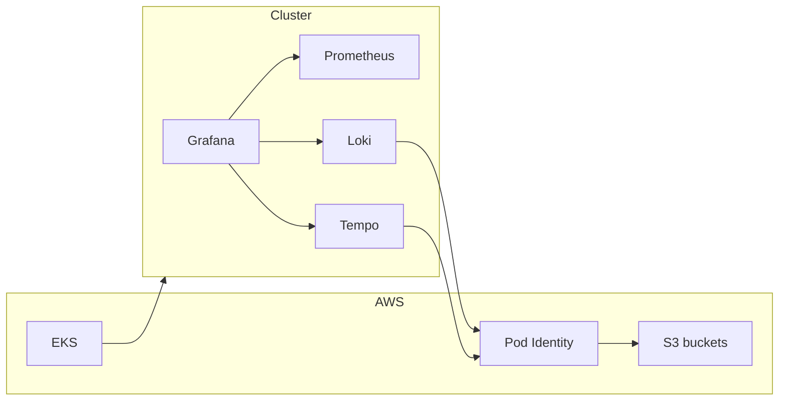

# Cloud-native observability (portfolio demo)

Public demo: **no employer data, no real accounts, no secrets in git.**

## Cost

| What | Typical cost |
|------|----------------|
| Read / interview use | **$0** |
| Local Kubernetes (kind, minikube, k3d) + your own Helm | **$0** |
| AWS via Terraform (`./scripts/terraform-apply-demo.sh`) | **Billable** — about **$160–220/mo** ballpark for EKS control plane + **1× t3.large** + **single NAT** + small S3 (verify with [AWS Pricing Calculator](https://calculator.aws/)); run `terraform output cost_estimate_note` after apply |

## What this repo does

**Terraform** provisions a minimal **VPC → EKS (1 node) → S3** setup, **EKS Pod Identity** (not IRSA) for Loki/Tempo/Mimir buckets, then **Helm**: Prometheus, Loki (S3), Tempo (S3), Grafana. **Mimir** is not installed as Helm on one node; its bucket + IAM are ready for your fork.

Entry points: [terraform/README.md](terraform/README.md), [terraform/envs/demo/README.md](terraform/envs/demo/README.md), [docs/architecture.md](docs/architecture.md), [docs/SECURITY.md](docs/SECURITY.md).

## Architecture (high level)



## Repo layout

```
├── README.md
├── docs/
├── scripts/
│   ├── terraform-apply-demo.sh   # two-phase: AWS then Helm
│   └── kind-local.sh               # optional local cluster only
└── terraform/
    ├── README.md
    ├── modules/
    └── envs/demo/                  # includes envs/demo/helm-values/ for Terraform Helm releases
```

## Phases (mental model)

1. **Local** — `kind` / minikube; install charts yourself if you want $0.
2. **AWS demo** — `./scripts/terraform-apply-demo.sh` in a **lab** account only.
3. **Production** — add autoscaler, more nodes, External Secrets, audit logging, PrivateLink for cross-VPC ingest, etc. (not in this repo).

## Quick start (AWS)

```bash
./scripts/terraform-apply-demo.sh
# then:
cd terraform/envs/demo && terraform output -raw configure_kubectl | sh
terraform output -raw grafana_access
terraform output -raw grafana_admin_password
```

## License

MIT — see [LICENSE](LICENSE).
