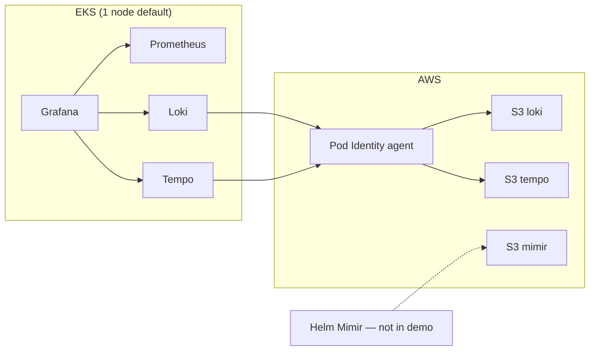

# Architecture (portfolio demo)

**No real org names, domains, ARNs, or secret paths.** Rationale for the Terraform + Helm path in this repo.

## Why EKS Pod Identity instead of IRSA?

| Topic | Pod Identity (this repo) | IRSA |
|--------|---------------------------|------|
| Trust | `pods.eks.amazonaws.com` + optional `aws:SourceArn` on the cluster | OIDC + `sts:AssumeRoleWithWebIdentity` |
| UX | Add-on maps `(cluster, namespace, service_account)` → role | Annotate each ServiceAccount with role ARN |
| Direction | AWS-aligned default for new EKS-only workloads | Still common on older clusters |

## Why one small node (default `t3.large`, desired `1`)?

- Keeps **portfolio spend** down (second node ~doubles EC2; control plane + NAT are fixed costs).
- **Scope:** demo traffic only; not HA ingest.
- **Scale later:** extra node groups, autoscaler/Karpenter, split ingest/query (hints in `terraform/envs/demo/main.tf` comments).

## Data flow

## IAM (least privilege)

- One IAM role per component (`mimir`, `loki`, `tempo`): S3 list + object APIs **only** on that bucket.
- Trust: account + **cluster ARN** (`aws:SourceArn`) where configured.
- `aws_eks_pod_identity_association` ties a named `ServiceAccount` in `monitoring` to that role.

## Kubernetes

- **PSA** on `monitoring`: enforce `baseline`, warn/audit `restricted` by default (`k8s_namespace.tf`). Relax via `psa_*` variables if a chart fails.
- **NetworkPolicies / mesh:** not in this demo (call out in interviews as a prod gap).

## Not production-ready (explicit)

- Grafana admin password from Terraform `random_password` (lab); use **External Secrets + Secrets Manager** when serious.
- No EKS **audit/api** logging or CloudWatch wired here.
- No cluster **autoscaler** Helm release by default.
- **PrivateLink** for cross-VPC `remote_write`: design in your fork / employer patterns; not duplicated here to avoid stale AWS-specific prose.

## Terraform entrypoints

- [terraform/README.md](../terraform/README.md)
- [terraform/envs/demo/README.md](../terraform/envs/demo/README.md)
- `./scripts/terraform-apply-demo.sh`

Applying Terraform costs real money — use a lab account.
